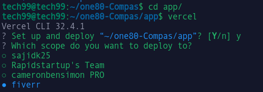
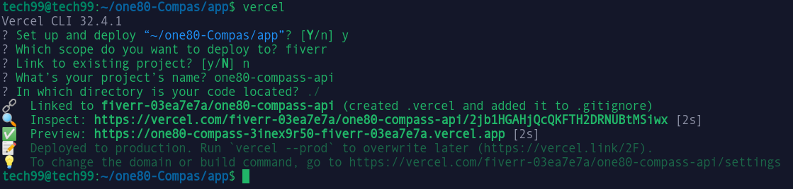
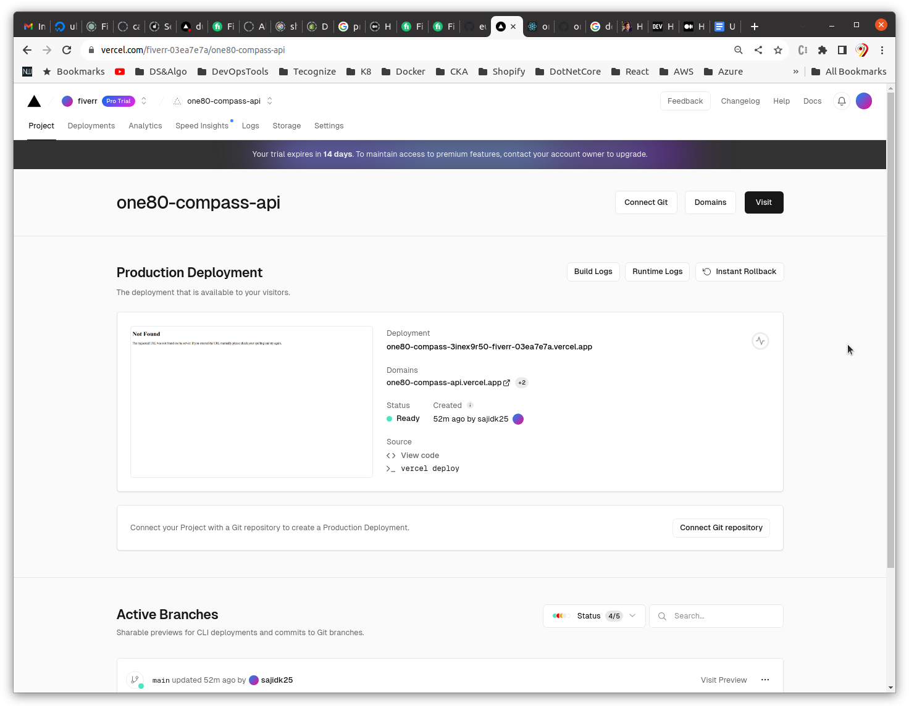
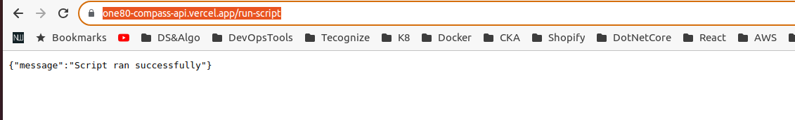

## To deploy a Flask app using Vercel, you can follow these steps:

1. First, make sure you have installed the Vercel CLI tool. You can install it using npm by running the following command:

    > npm install -g vercel

2. Next, Navigate to directory for your Flask app using the command line `cd app/`. then Add the required dependencies to the `requirements.txt` file:

    > pip freeze > requirements.txt

3. Create a new file called `vercel.json` in the root directory (`./app`)  of your app. This file will contain the configuration information for Vercel.

4. Add the following JSON code to the `app/vercel.json` file:

    ```
    {
        "builds": [
            {
                "src": "app.py",
                "use": "@vercel/python"
            }
        ],
        "routes": [
            {
                "src": "/(.*)",
                "dest": "app.py"
            }
        ]
    }

    ```

5. Finally, deploy your app to Vercel by running the following command:

    > vercel

6. Follow the prompts to configure your deployment, including setting up a Vercel account if you haven’t already.


    

    

7. Once the deployment is complete, you can access your Flask app by navigating to the URL provided by Vercel.

    

8. API URL `https://one80-compass-api.vercel.app/run-script`

    